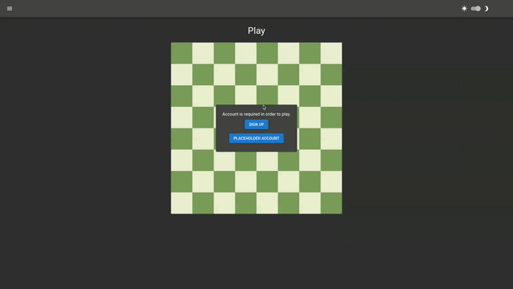
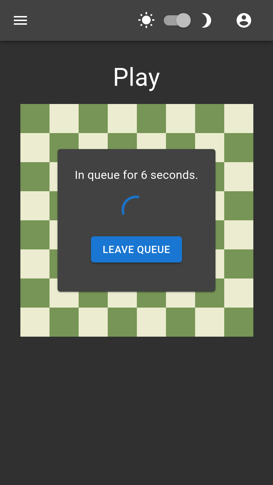
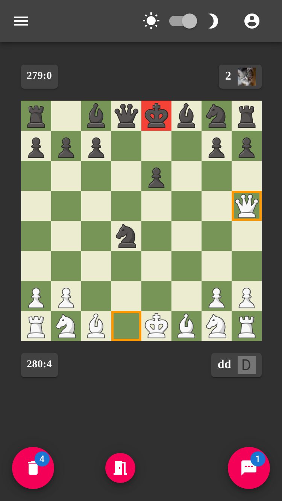
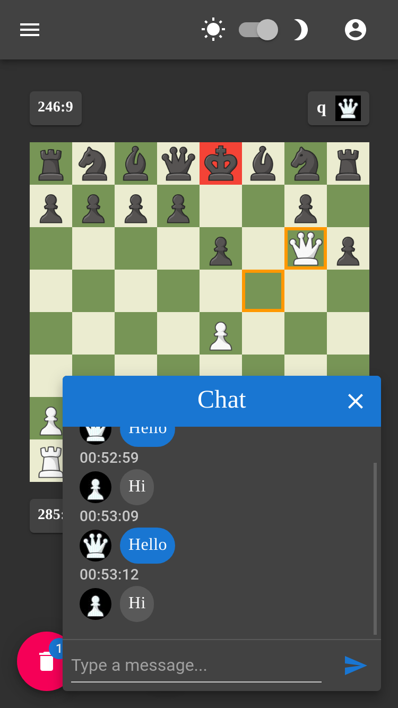
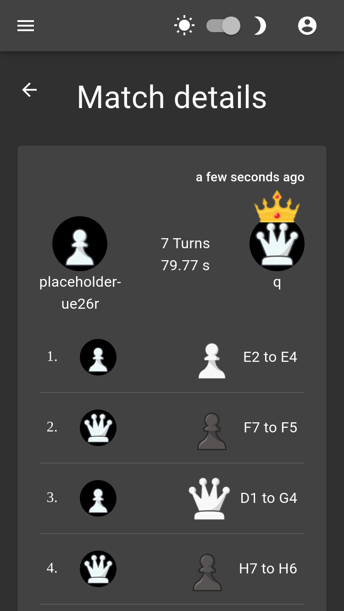
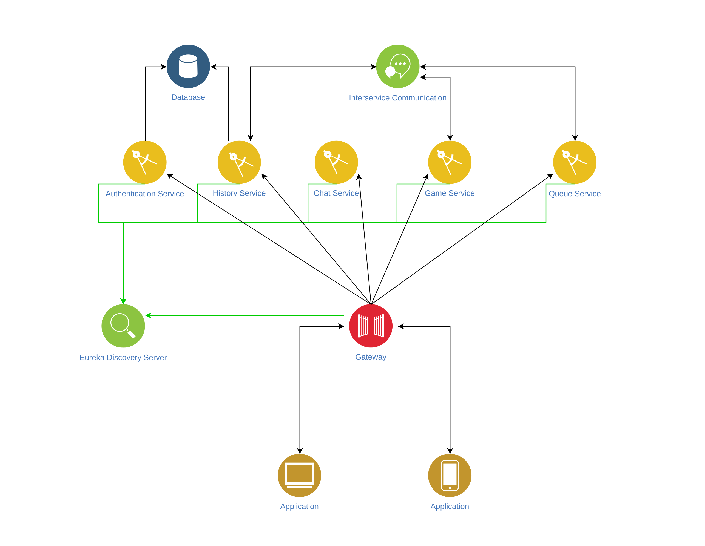

[](https://github.com/Nalhin/Chess/actions)
[](https://codecov.io/gh/Nalhin/Chess)
[](https://www.codefactor.io/repository/github/nalhin/chess)
[](LICENSE.md)


# Chess

A Website that allows users to participate in online chess games.

## Table of contents

* [Description](#description)
* [Features](#features)
* [Presentation](#presentation)
* [Technology Stack](#technology-stack)
* [Architecture](#architecture)
* [Folder Structure](#folder-structure)
* [Prerequisites](#prerequisites) 
* [Installation](#installation)
* [Tests](#tests)
* [License](#license)

## Description

Frontend is written entirely in React and Typescript.
Flux architecture (Redux, Redux-Saga and rxjs) allows application's view layer to work independently,
resulting in less overhead, cleaner code and easier testing.

On the other hand, backend is written in Java and designed in docker oriented microservice architecture,
utilizing Spring Boot's versatility. Chess logic is written entirely from scratch, without the use of any chess engine.

Necessary data is preserved in MySQL database.

## Features
    
* Light/Dark theme
* Authentication
* Profiles
* Queue
* Chess games
* Chat
* Match history

## Presentation

#### Overview

<p align="center">
  <a href="https://www.youtube.com/watch?v=JhKo3N3bbAg">
    
  </a>
</p>

#### Queue

<p align="center"> 
  
</p>

#### Board

<p align="center"> 
  
</p>

#### Messages

<p align="center"> 
  
</p>

#### Match History

<p align="center"> 
  
</p>


## Technology Stack

### Frontend

* React
* Redux
* Redux-Saga
* Rxjs
* Websockets
* React DnD
* Material UI
* Emotion
* React Testing Library

### Backend

* Java
* Spring Boot
* Spring Security
* Spring MVC
* Spring Messaging
* Eureka Discovery Server
* Spring Cloud Gateway
* JUnit 5
* Mockito
* Kafka
* Mysql
* Docker

## Architecture


<p align="center"> 
  
</p>


## Folder Structure

#### Frontend

```
src
├── components (reusable components)
├── interfaces (typescript interfaces)
├── pages (routing with associated pages and components)
├── store (redux store)
│   ├── chat
│   ├── customRouter
│   ├── user
│   ├── gameHistory
│   ├── queue
│   ├── toaster
│   └── game
│       ├── game.actions.ts
│       ├── game.saga.ts
│       ├── game.reducer.ts
│       ├── game.types.ts
│       ├── game.subscriptions.ts
│       ├── game.api.ts
│       └── game.selectors.ts
│
├── styles (theme and style variables)
├── utils (utility functions)
└── websocket (websocket config and helpers)
```

#### Backend

```
server 
├── authentication-service
├── chat-service
├── game-service 
├── queue-service
├── history-service
├── gateway-service
└── eureka-server
```

## Prerequisites

#### Frontend

Install node package manager [npm](https://www.npmjs.com/).
You should be able to run the following commands.

```bash
node --version
npm --version
```

#### Backend

Install [jdk13](https://www.oracle.com/java/technologies/javase-jdk13-downloads.html) and [maven](https://maven.apache.org/).

You should be able to run the following commands.

```bash
java --version
mvn --version
```

Install [docker](https://docs.docker.com/install/) and [docker-compose](https://docs.docker.com/compose/).
You should be able to run the following commands.

```bash
docker --version
docker-compose --version
```

## Installation

#### Frontend

```bash
cd app 
npm install
npm run start
```

#### Backend

```bash
cd server
mvn clean install
docker-compose up
```

## Tests

In order to manually run tests, follow the instructions below.

#### Frontend 

```bash
cd app && npm run test
```

#### Backend

```bash
cd server && mvn verify
```

## License

This project is licensed under the MIT License - see the [LICENSE.md](LICENSE.md) file for details.
